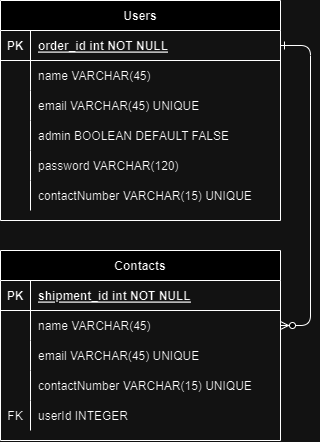

# Documentação da API - Contact Hub
---

## 1. Visão Geral

Tecnologias usadas no desenvolvimento desta api:

- [NodeJS](https://nodejs.org/en/)
- [Express](https://expressjs.com/pt-br/)
- [TypeScript](https://www.typescriptlang.org/)
- [PostgreSQL](https://www.postgresql.org/)
- [TypeORM](https://typeorm.io/)

A URL base da aplicação em produção: https://contacthubws.onrender.com
---

## 2. Diagrama ER

Diagrama ER da API definindo bem as relações entre as tabelas do banco de dados.



---

### 3 Instalando Dependências

Clone o projeto em sua máquina e instale as dependências com o comando:

```shell
npm install
```

### 3.1. Variáveis de Ambiente

Em seguida, crie um arquivo **.env**, copiando o formato do arquivo **.env.example**:
```
cp .env.example .env
```

Configure suas variáveis de ambiente com suas credenciais do Postgres e uma nova database da sua escolha.

### 3.2. Migrations

Execute as migrations com o comando:

```
npm typeorm migration:run -d src/data-source.ts
```
---
## 4. Autenticação

-É preciso estar autenticado para acessar as seguintes rotas:
| Método   | Rota(USER) | 
|----------|------------| 
| GET      | /users/all/users| 
| GET      | /users/:id|  
| PATCH      |/users/:id| 
| DELETE     |/users/:id| 
| POST      |/contact| 
| GET      |/contact/:id| 
| GET      |/contact/all/contacts| 
| PATCH     |/contact/:id|
| DELETE     |/contact/:id|
| GET     |/report/:id|

##4.1. A autenticação é feita por meio do Login (POST /login), gerando um token (Bearer Token) de acesso.

## 1. **Users**

O objeto User é definido como:

| Campo          | Tipo   | Descrição                                       |
| ---------------|--------|-------------------------------------------------|
| id             | number | Identificador único do usuário                  |
| name           | string | O nome do usuário.                              |
| email          | string | O e-mail do usuário.                            |
| password       | string | A senha de acesso do usuário                    |
| contactNumber  | string | número de telefone do usuário                   |
| admin          | boolean| Define se um usuário é Administrador ou não.    |
| createdAt      | date   | Data de criação do usuário                      |

###1.1. Endpoints

| Método   | Rota       | Descrição                               |
|----------|------------|-----------------------------------------|
| POST     | /users     | Criação de um usuário.                  |
| GET      | /users     | Lista todos os usuários                 |
| GET      | /users/:id | Lista um usuário usando seu ID como parâmetro|
| PATCH      |/users/:id| Atualização de um usuário usando seu id como parâmetro|
| DELETE     |/users/:id| Deleção de um usuário usando seu id como parâmetro|
---

### 1.2. **Criação de Usuário**


### `/users`

### Exemplo de Request:
```
POST /users
Authorization: None
Content-type: application/json
```

### Corpo da Requisição:
```json
{
	"name": "user",
	"email": "user@mail.com",
	"contactNumber": "35998776644",
	"password": "1234",
	"admin": true,
}
```

```
201 Created
```
```json
{
	"id": "1",
	"name": "user",
	"email": "user@mail.com",
	"contactNumber": "35998776644",
	"isAdm": true,
	"createdAt": 06/02/2023
}
```

### Possíveis Erros:
| Código do Erro | Descrição |
|----------------|-----------|
| 409 Conflict   | Email already registered. |

---

### 1.3. **Listando Usuários**


### `/users/all/users`

### Exemplo de Request:
```
GET /users
Authorization: Bearer Token
Content-type: application/json
```

### Corpo da Requisição:
```json
{
Vazio
}
```

### Exemplo de Response:
```
200 OK
```
```json
[
	{
		"id": "1",
		"name": "user",
		"email": "user@mail.com",
		"contactNumber": "35998776644",
		"isAdm": true
		"createdAt": 06/02/2024
	}
]
```

### Possíveis Erros:
Se nenhum usuário cadastrado, irá retornar uma lista vazia.

---

### 1.4. **Listar Usuário por ID**


### `/users/:id`

### Exemplo de Request:
```
GET /users/1
Authorization: Bearer Token
Content-type: application/json
```

### Parâmetros da Requisição:
| Parâmetro   | Tipo        | Descrição                             |
|-------------|-------------|---------------------------------------|
|      id     | string      | Identificador único do usuário (User) |

### Corpo da Requisição:
```json
Vazio
```

### Exemplo de Response:
```
200 OK
```
```json
{
	"id": "1",
	"name": "user",
	"email": "user@mail.com",
	"contactNumber": "35998776644",
	"isAdm": true,
	"createdAt": 06/02/2024
}
```

### Possíveis Erros:
| Código do Erro | Descrição |
|----------------|-----------|
| 404 Not Found   | User not found. |

---
### 1.4. **Atualização de usuários por ID**


### `/users/:id`

### Exemplo de Request:
```
GET /users/1
Authorization: Bearer Token
Content-type: application/json
```

### Parâmetros da Requisição:
| Parâmetro   | Tipo        | Descrição                             |
|-------------|-------------|---------------------------------------|
|      id     | string      | Identificador único do usuário (User) |

### Corpo da Requisição:
```json
	"name": "user2",
	"email": "user2@mail.com",
	"contactNumber": "35998756786",
	"password": "12345"
```

### Exemplo de Response:
```
200 OK
```
```json
{
	"id": "1",
	"name": "user2",
	"email": "user2@mail.com",
	"contactNumber": "35998756786",
	"isAdm": true,
	"createdAt": 06/02/2024
}
```

### Possíveis Erros:
| Código do Erro | Descrição |
|----------------|-----------|
| 404 Not Found  | User not found. |
| 409 Conflict   | Email already registered.|
| 409 Conflict   | Phone number already registered.|
| 409 Conflict   | Name number already registered.|
---
### 1.5. **Deleção de usuários por ID**


### `/users/:id`

### Exemplo de Request:
```
GET /users/1
Authorization: Bearer Token
Content-type: application/json
```

### Parâmetros da Requisição:
| Parâmetro   | Tipo        | Descrição                             |
|-------------|-------------|---------------------------------------|
|      id     | string      | Identificador único do usuário (User) |

### Corpo da Requisição:
```json
vazio
```

### Exemplo de Response:
```
200 OK
```
```json
{
vazio
}
```

### Possíveis Erros:
| Código do Erro | Descrição |
|----------------|-----------|
| 404 Not Found   | User not found. |
---

## 2. **Contacts**

O objeto Contact é definido como:

| Campo          | Tipo   | Descrição                                       |
| ---------------|--------|-------------------------------------------------|
| id             | number | Identificador único do contato                  |
| name           | string | O nome do contato.                              |
| email          | string | O e-mail do contato.                            |
| contactNumber  | string | Número de telefone do contato.                  |
| createdAt      | date   | Data de criação do contato.                     |

###1.1. Endpoints

| Método   | Rota       | Descrição                               |
|----------|------------|-----------------------------------------|
| POST     | /contact     | Criação de um contato.                  |
| GET      | /contact     | Lista todos os contatos.                 |
| GET      | /contact/:id | Lista um contato usando seu ID como parâmetro|
| PATCH      |/contact/:id| Atualização de um contato usando seu id como parâmetro|
| DELETE     |/contact/:id| Deleção de um contato usando seu id como parâmetro|
---

### 1.2. **Criação de Contato**

### `/contact`

### Exemplo de Request:
```
POST /contact
Authorization: Bearer Token
Content-type: application/json
```

### Corpo da Requisição:
```json
{
	"name": "Marcos",
	"email": "marcos@mail.com",
	"contactNumber": "35991755445",
}
```

```
201 Created
```
```json
{
	"id": "1",
	"name": "Marcos",
	"email": "marcos@mail.com",
	"contactNumber": "35991755445",
	"createdAt": 06/02/2023
}
```

### Possíveis Erros:
| Código do Erro | Descrição |
|----------------|-----------|
| 409 Conflict   | Email already registered. |
| 409 Conflict   | Name already registered. |
| 409 Conflict   | Phone number already registered. |

---

### 1.2. **Listando Contatos**


### `/contact/all/contacts`

### Exemplo de Request:
```
GET /users
Authorization: Bearer Token
Content-type: application/json
```

### Corpo da Requisição:
```json
Vazio
```

### Exemplo de Response:
```
200 OK
```
```json
[
	{
		"id": "1",
		"name": "user",
		"email": "user@mail.com",
		"contactNumber": "35991755445",
		"isAdm": true
		"createdAt": 06/02/2024
	},
	{
		"id": "2",
		"name": "user3",
		"email": "user3@mail.com",
		"contactNumber": "35991753344",
		"isAdm": true
		"createdAt": 06/02/2024
	}
]
```

### Possíveis Erros:
Se nenhum usuário cadastrado, irá retornar uma lista vazia.

---

### 1.3. **Listar Contato por ID**

### `/contact/:id`

### Exemplo de Request:
```
GET /contact/1
Authorization: Bearer Token
Content-type: application/json
```

### Parâmetros da Requisição:
| Parâmetro   | Tipo        | Descrição                             |
|-------------|-------------|---------------------------------------|
|      id     | string      | Identificador único do contato (Contact) |

### Corpo da Requisição:
```json
Vazio
```

### Exemplo de Response:
```
200 OK
```
```json
{
	"id": "1",
	"name": "Marcos",
	"email": "marcos@mail.com",
	"contactNumber": "35991755445",
	"createdAt": 06/02/2024
}
```

### Possíveis Erros:
| Código do Erro | Descrição |
|----------------|-----------|
| 404 Not Found   | Contact not found. |

---
### 1.4. **Atualização de contatos por ID**

### `/contact/:id`

### Exemplo de Request:
```
GET /contact/1
Authorization: Bearer Token
Content-type: application/json
```

### Parâmetros da Requisição:
| Parâmetro   | Tipo        | Descrição                             |
|-------------|-------------|------------------------------------------|
|      id     | string      | Identificador único do contato (Contact) |

### Corpo da Requisição:
```json
	"name": "Marcos novo",
	"email": "user2@mail.com",
	"contactNumber": "35991755445"
```

### Exemplo de Response:
```
200 OK
```
```json
{
	"id": "1",
	"name": "user2",
	"email": "user2@mail.com",
	"contactNumber": "35991755445",
	"isAdm": true,
	"createdAt": 06/02/2024
}
```

### Possíveis Erros:
| Código do Erro | Descrição |
|----------------|-----------|
| 404 Not Found   | User not found. |
| 409 Conflict   | Email already registered.|
| 409 Conflict   | Phone number already registered.|
| 409 Conflict   | Name number already registered.|
---
### 1.5. **Deleção de contatos por ID**

### `/contact/:id`

### Exemplo de Request:
```
GET /users/1
Authorization: Bearer Token
Content-type: application/json
```

### Parâmetros da Requisição:
| Parâmetro   | Tipo        | Descrição                             |
|-------------|-------------|---------------------------------------|
|      id     | string      | Identificador único do contato (Contact) |

### Corpo da Requisição:
```json
vazio
```

### Exemplo de Response:
```
200 OK
```
```json
{
vazio
}
```

### Possíveis Erros:
| Código do Erro | Descrição |
|----------------|-----------|
| 404 Not Found   | Contact not found. |
---

## 3. **Report - Relatório**

###1.1. Endpoints

| Método   | Rota       | Descrição                               |
|----------|------------|-----------------------------------------|
| GET   | /report/:id     | Leitura de relatório geral            |
---
### `/report/:id`

### Exemplo de Request:
```
GET /report/:id
Authorization: Bearer Token
Content-type: application/json
```

### Corpo da Requisição:
```json
{
vazio
}
```

```
200 OK
```
```json
{
	"user": {
		"id": 2,
		"name": "u",
		"email": "u5@kenzie.com.br",
		"admin": true,
		"contactNumber": "13234",
		"createdAt": "2024-02-25"
	},
	"totalContacts": 1,
	"recentContacts": [
		{
			"id": 3,
			"name": "J2er",
			"email": "22@3kenze.com.br",
			"contactNumber": "5532323223",
			"createdAt": "2024-02-25"
		}
	]
}
```
